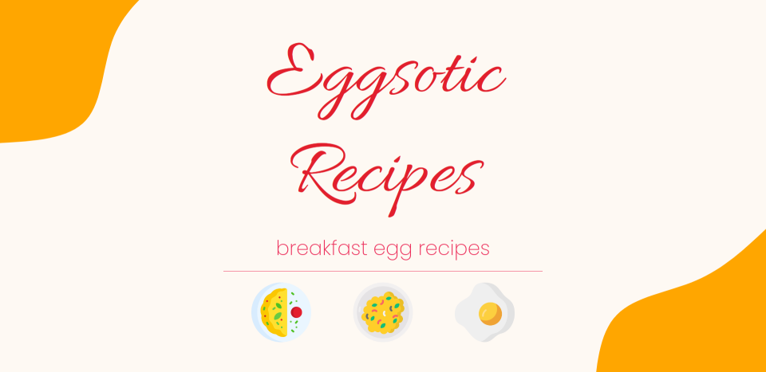

# Eggsotic Recipes

This project demonstrates a simple recipe website built using HTML and CSS as part of The Odin Project.

## Screenshots

## Credits

#### Images

French omelette image by [Valereee](https://commons.wikimedia.org/wiki/File:Blond_unbrowned_omelet_with_mushrooms_and_herbs.jpg), [CC BY-SA 4.0](https://creativecommons.org/licenses/by-sa/4.0), via Wikimedia Commons

Scrambled eggs image by [Takeaway](https://commons.wikimedia.org/wiki/File:Scrambed_eggs.jpg), [CC BY-SA 3.0](https://creativecommons.org/licenses/by-sa/3.0s), via Wikimedia Commons

Fried egg image by [Matthew Murdoch](https://commons.wikimedia.org/wiki/File:Fried_Egg_2.jpg), [CC BY 2.0](https://creativecommons.org/licenses/by/2.0), via Wikimedia Commons

#### Icons

Omelette icon created by [Freepik](https://www.flaticon.com/authors/freepik), via [Flaticon](https://www.flaticon.com)

Scrambled eggs icons created by [Triangle Squad](https://www.flaticon.com/authors/triangle-squad), via [Flaticon](https://www.flaticon.com)

Protein icons created by [Freepik](https://www.flaticon.com/authors/freepik), via [Flaticon](https://www.flaticon.com)

## License

This project is licensed under the terms of the [GPL](https://www.gnu.org/licenses/gpl-3.0.en.html) open source license.
